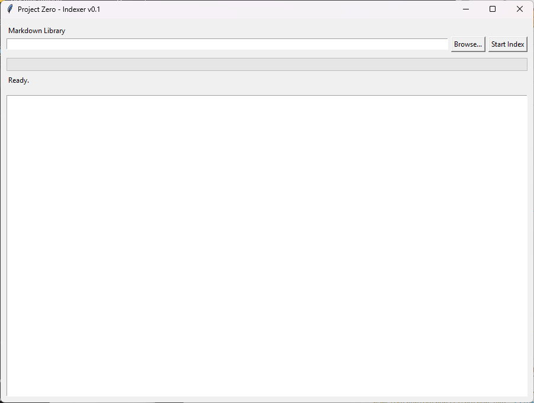

# PZ Indexer

PZ Indexer is the second application in the Project Zero suite.

Its purpose is to build a fast, searchable SQLite index from Markdown conversations generated by PZ Extractor. This index serves as the foundation for Project Zero's search, knowledge extraction, and asset management capabilities.

---

## Screenshot

---

## Purpose

PZ Indexer transforms thousands of Markdown conversations into a structured local database by extracting metadata for each conversation.

The application is designed to make years of AI conversations searchable without relying on external services.

---

## Current Features

- Desktop interface
- Select Markdown library
- Recursive Markdown scanning
- SQLite database creation
- Conversation metadata extraction
- SHA-256 hash generation
- Word count
- Character count
- File size tracking
- Progress bar
- Live indexing log
- Background indexing

---

## Database

Current database:

`project_zero.db`

Current table:

`conversations`

Stored metadata:

- Title
- Filename
- File path
- Word count
- Character count
- File size
- SHA-256 hash

---

## Requirements

- Python 3.11 or newer

Uses only Python standard libraries.

No additional packages are required.

---

## Roadmap

### Version 0.1

- ✅ Build SQLite database
- ✅ Index Markdown conversations
- ✅ Extract conversation metadata

### Version 0.2

- Search interface
- Open Markdown files
- Sort results

### Version 0.3

- Full-text indexing
- Message indexing
- Faster incremental indexing

### Version 0.4

- Automatic tagging
- Project relationships
- Asset extraction

### Version 1.0

Complete indexing engine for the Project Zero Knowledge Vault.

---

## Part of the Project Zero Suite

- PZ Extractor
- PZ Indexer
- PZ Search
- PZ Knowledge
- PZ Vault

---

## Project Philosophy

Project Zero follows one simple principle:

> Recover first. Build second.

Rather than recreating ideas, Project Zero helps recover, organize, and leverage years of existing intellectual property.

---

## Status

**Current Version:** v0.1

**Status:** Actively under development